# Customer Shopping Data Analysis

Exploratory analysis of customer shopping behavior across 10 Istanbul malls (2021–2023), covering gender, age, category preferences, and sales trends.

## Dataset
Available on Kaggle: [Customer Shopping Dataset](https://www.kaggle.com/datasets/mehmettahiraslan/customer-shopping-dataset)  
Download and place `customer_shopping_data.csv` in the root directory before running.

## Setup
```bash
pip install -r requirements.txt
```

## Notebook Structure
- **Data Validation** — checks for missing values, duplicates, and bogus entries
- **Gender Distribution** — customer split by gender
- **Time-Based Sales** — monthly sales trends per mall
- **Category Distribution** — most purchased product categories
- **Gender & Category** — buying behavior across genders
- **Age Group Analysis** — revenue, preferences, and gender breakdown by age
- **Key Insights** — data-backed conclusions drawn from the analysis

## Tech Stack
- Python
- Pandas
- Matplotlib
- Seaborn
- Jupyter Notebook

## Feature Engineering
- Created `age_group` column by binning continuous `age` into categorical groups: `<20, 20–29, 30–39, 40–49, 50–59, 60–69, 70+`

## Project Structure
```
customer-shopping-analysis/
├── images/
│   ├── gender_distribution.png
│   ├── category_distribution.png
│   ├── category_count_by_gender.png
│   ├── total_sales_by_age_group.png
│   ├── sales_by_category_age_heatmap.png
│   ├── gender_distribution_age_group.png
│   ├── heatmap_age_category_gender.png
│   ├── sales_over_time_Cevahir_AVM.png
│   ├── sales_over_time_Emaar_Square_Mall.png
│   ├── sales_over_time_Forum_Istanbul.png
│   ├── sales_over_time_Istinye_Park.png
│   ├── sales_over_time_Kanyon.png
│   ├── sales_over_time_Mall_of_Istanbul.png
│   ├── sales_over_time_Metrocity.png
│   ├── sales_over_time_Metropol_AVM.png
│   ├── sales_over_time_Viaport_Outlet.png
│   └── sales_over_time_Zorlu_Center.png
├── main.ipynb
├── README.md
└── requirements.txt
```

## Key Findings

- Female customers account for ~60% of the customer base, outpurchasing males across nearly all categories
- **Clothing** dominates all categories by a significant margin, followed by Shoes and Technology
- Sales remain stable across all 10 malls with no strong seasonal trend (2021–2023)
- The **30–49 age group** generates the highest revenue, with spending dropping notably below 20 and above 60
- Female shoppers aged 30–49 purchasing Clothing represent the highest-revenue micro-segment

## Visualizations

| Gender Distribution | Category Distribution |
|---|---|
| 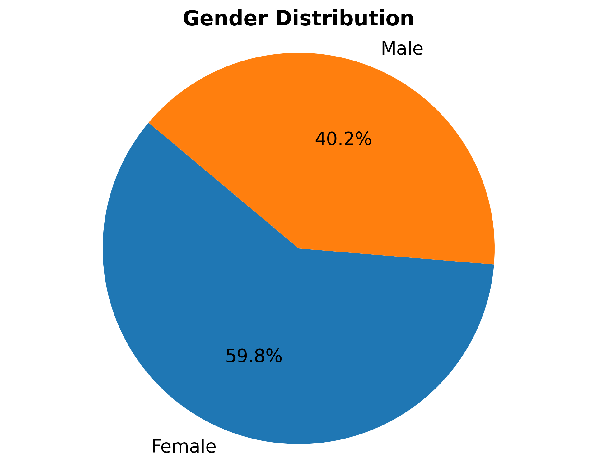 | 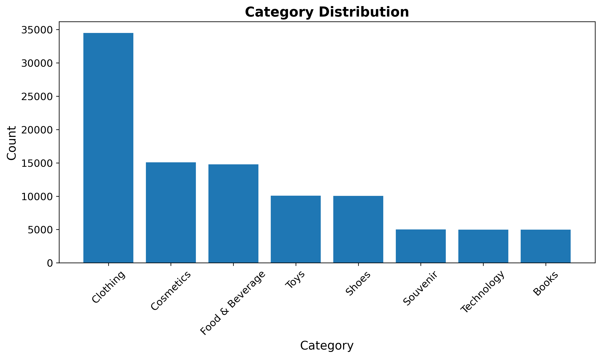 |

| Category by Gender | Total Sales by Age Group |
|---|---|
| 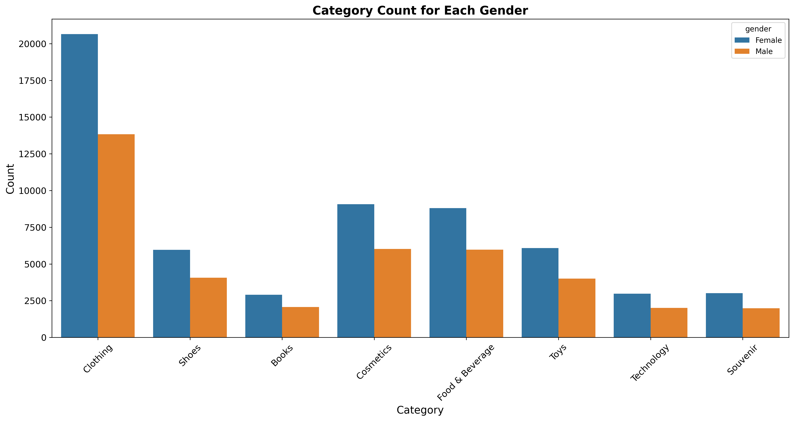 | 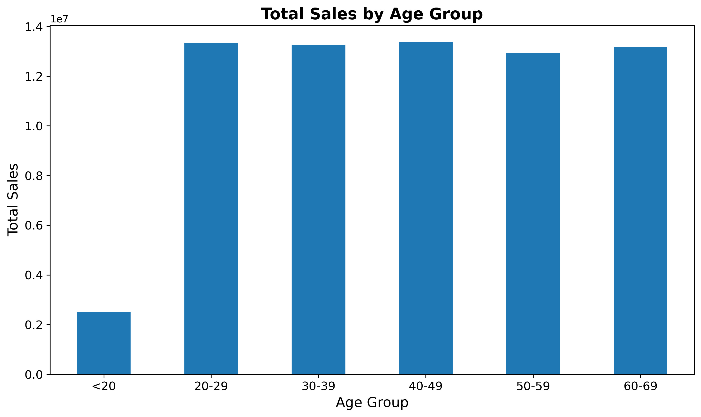 |

| Sales by Category Across Age Groups | Gender Distribution by Age Group |
|---|---|
| 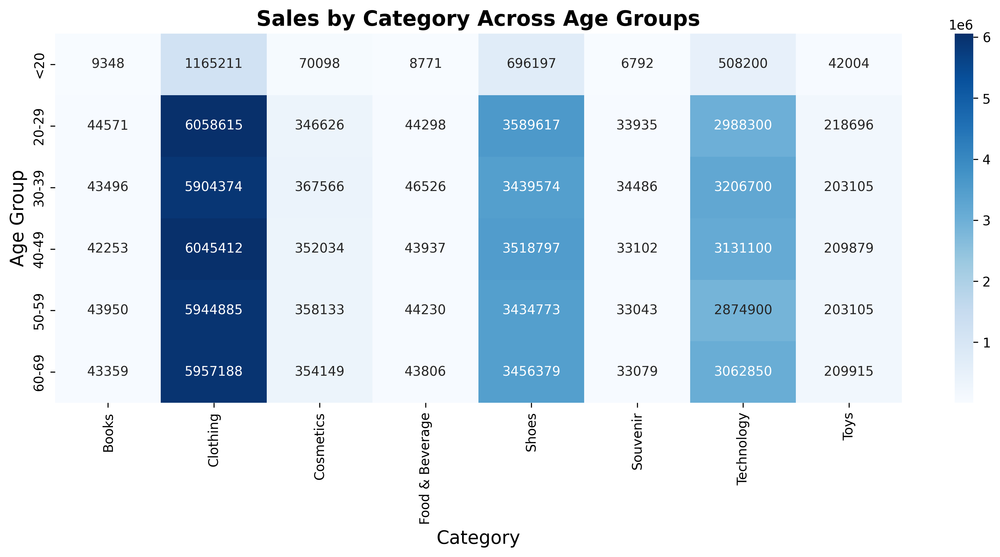 | 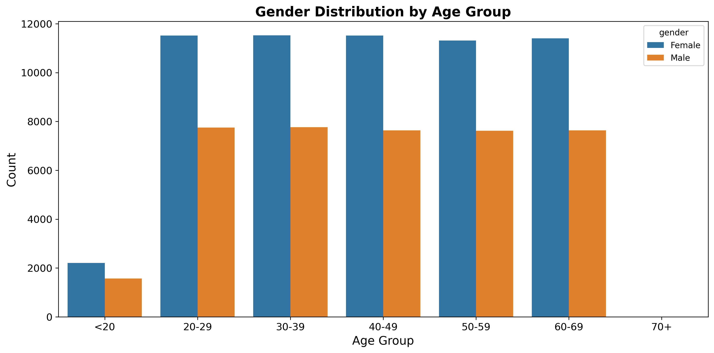 |

| Sales Heatmap: Age × Category × Gender |
|---|
| 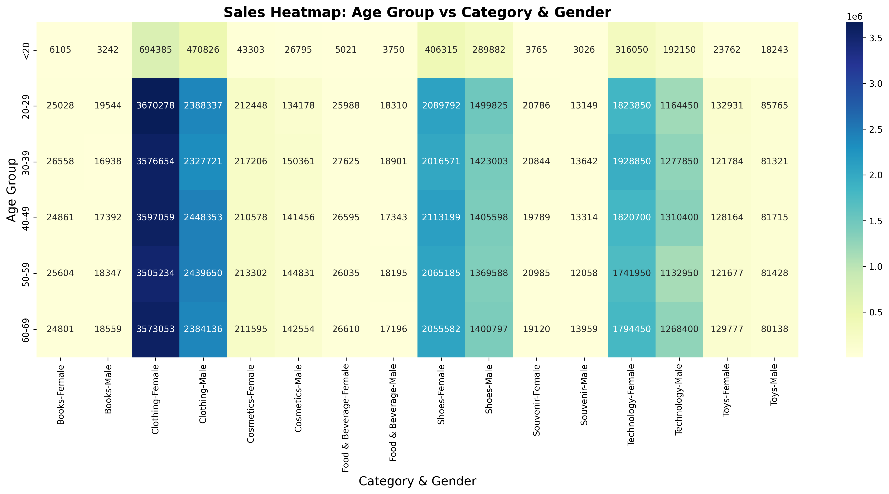 |

<details>
<summary>Sales Over Time — All Malls</summary>

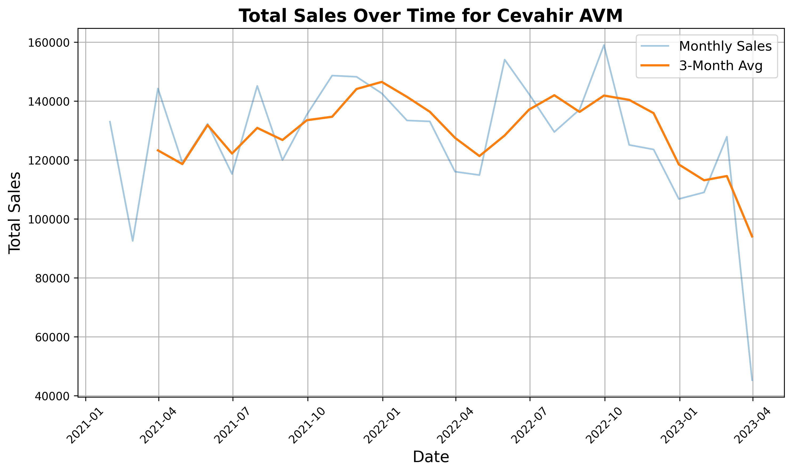
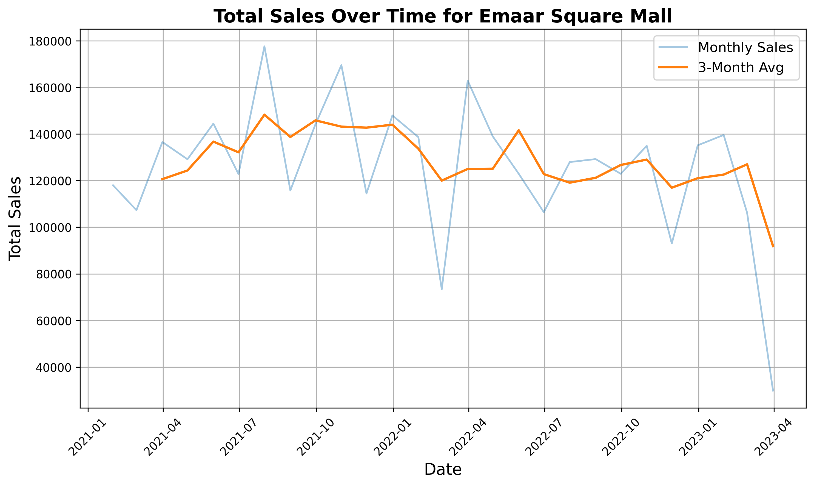
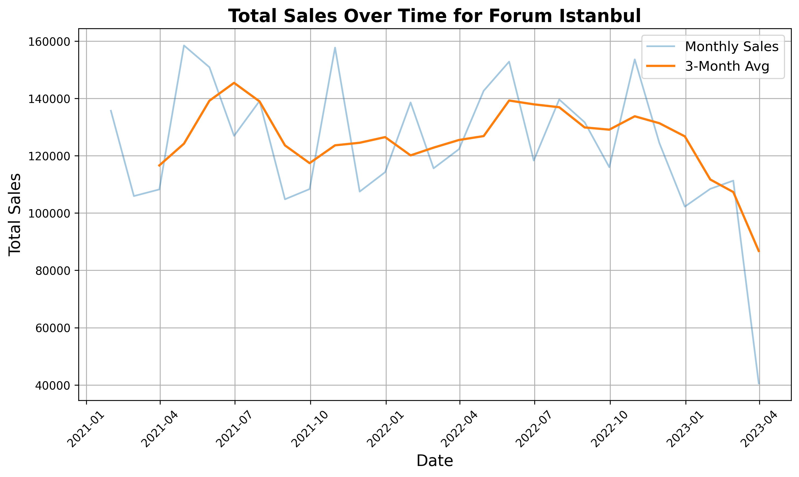
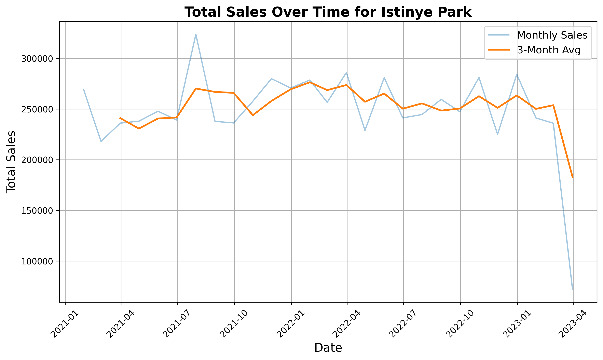
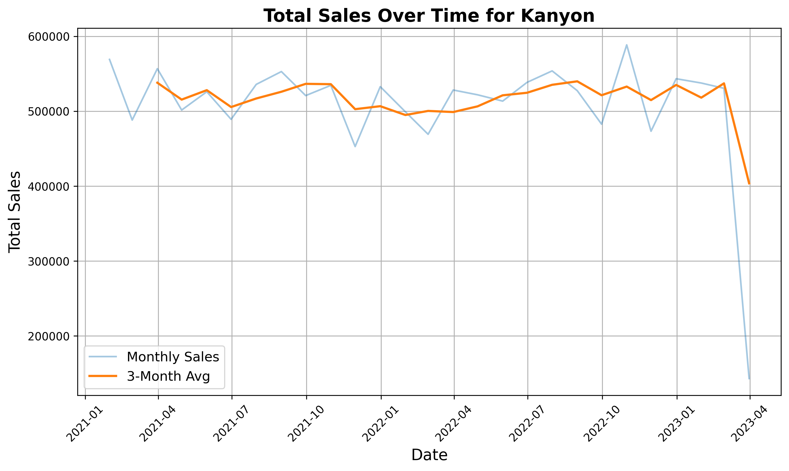
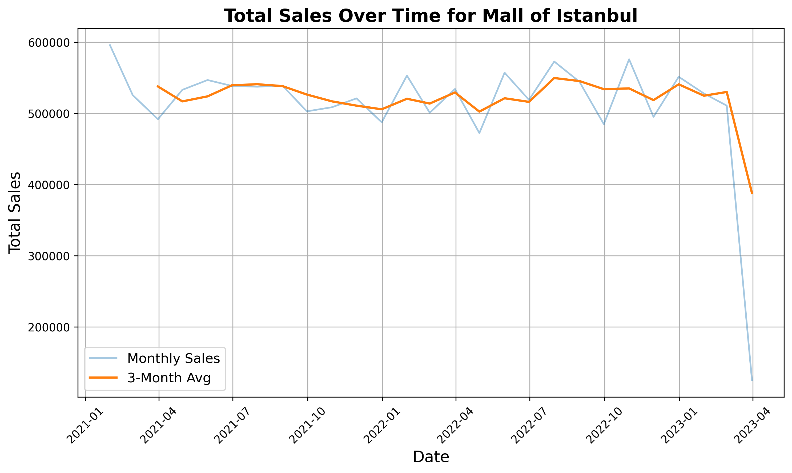
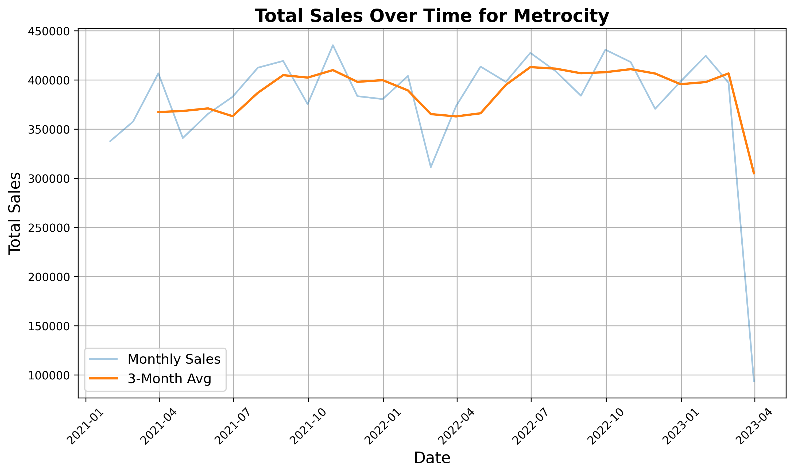
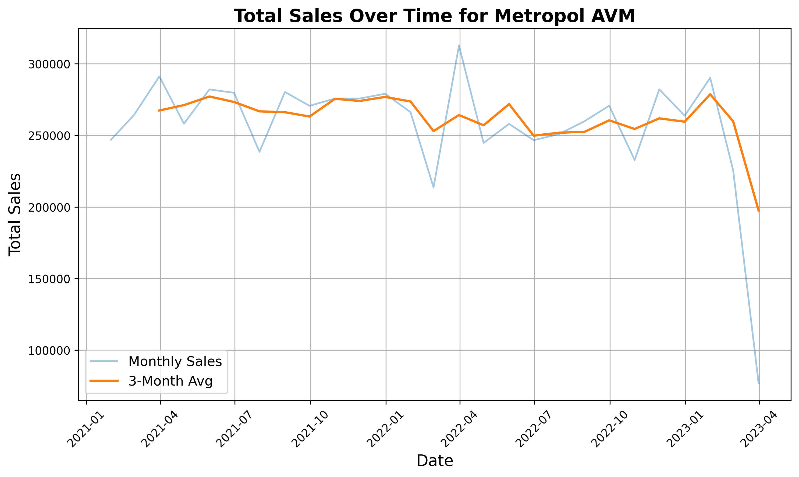
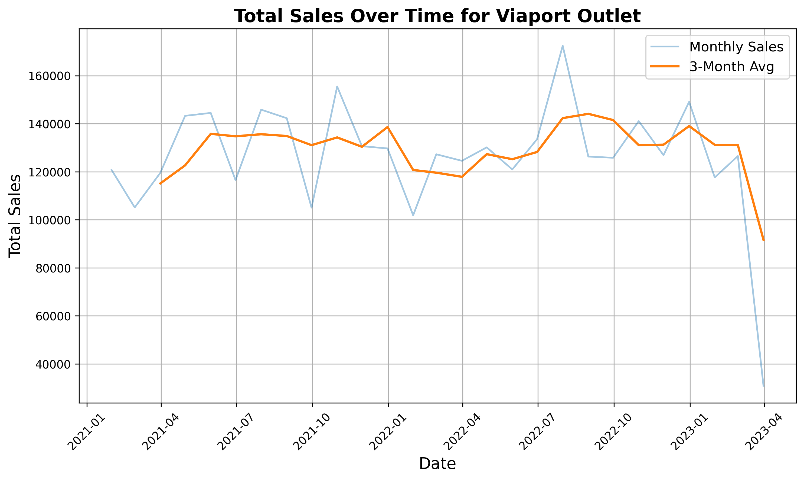
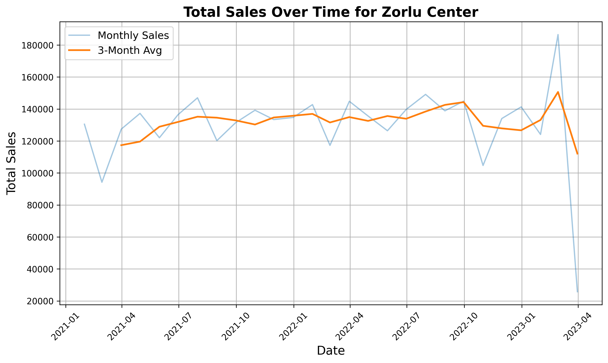

</details>

## Author
[Zain Ali](https://github.com/ZainAli-2001)
